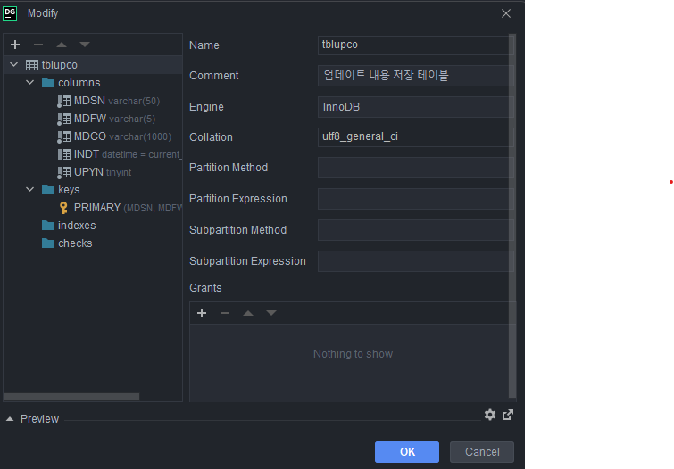

# \<DataGrip>
**그냥 몇가지 잡다한 DataGrip 툴 사용기록**
 
 
 

## 컬럼세팅

 
- Primary Key 설정 : keys 란에 primary 체크박스 설정하고 생성하면 Primary Key로 설정된다.
- Unique Key 설정 : keys 란에 primary 체크박스 해제하고 생성하면 Unique Key로 설정된다.
- index(key) 설정 : indexes 란에 설정하면 key로 설정된다.