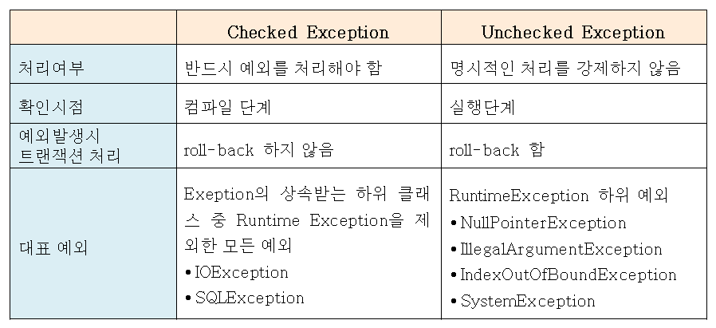

# 예외처리(Exception)
**쉽게 생각할 수 있지만 실수하기 쉽고 서비스의 운영, 개선에 있어 필수적인 예외처리**
#

## 예외란?
- 사용자의 잘못된 조작이나 개발자의 코딩 실수로 인해 발생하는 프로그램 오류를 말한다.  
예외가 발생하면 프로그램은 곧바로 종료된다는 점에서 에러와 동일하나, 예외 처리를 통해 프로그램을 종료하지 않고 정상 실행 상태가 유지되도록 할 수도 있고, 예외 상황을 명확하게 파악하기 위해 부가 정보를 남길 수도 있다.

## 예외의 종류
- 큰 틀에서 분류하자면 두 가지로 나눌 수 있다.

1. Checked Exception: 개발자가 반드시 예외처리를 명시하도록 강제된다는 특징 (미처리 시 컴파일 불가)
2. Unchecked Exception: 예외처리를 하도록 강제받지 않음 (미처리 시 컴파일 가능)

## 인터넷에 있는 자료의 문제점
인터넷에서 Exception에 대해서 찾아보면 이러한 표를 쉽게 볼 수 있다.  


이에 대해 현재 MS 개발자 이자 여러 자바, 스프링 관련 강의를 만드신 '백기선' 님이 남긴 영상이 있다.  

(백기선님 유튜브 영상 링크) https://www.youtube.com/watch?v=_WkMhytqoCc  

영상 제목이 다소 자극적이긴 하지만 영상의 요지는 '스프링에서의 기본설정을 왜 Checked Exception과 Unchecked Exception의 개념으로 정의하나?' 라고 해석했다.  
사실 저 표에 나와있는 '트랜잭션 처리' 부분은 정확한 표현이 아니다.  
정확히 말하자면, 저 설명은 '스프링의 기본(default) 동작' 이라고 표현하는게 맞다고 본다.  
```
자바는 자체적으로 Checked Exception과 Unchecked Exception의 트랜잭션 처리를 지원하지 않는다!  
```
단지 **스프링 프레임워크** 가 해당 트랜잭션 처리를 도와주는 것 뿐이다.  
하지만 그마저도 **기본설정일 뿐이지, Checked Exception도 롤백을 수행하게 할 수 있고, Unchecked Exception도 롤백을 수행하지 않게 설정할 수 있다**.  
  
물론 경험이 많거나, 해당 지식을 보유하신 분들은 내용을 잘 이해할 수 있겠지만, 처음 Exception의 개념에 대해서 공부하시는 분들의 이해에 혼선이 있을 것 같아 남긴다.

