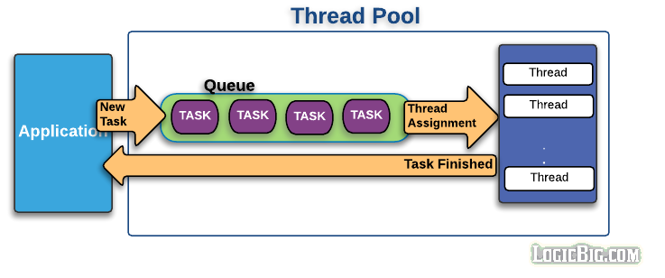

# 스레드 풀(Thread Pool)
**효율적인 작업처리를 위한 멀티 스레딩 기법을 위해 필수적인 스레드 풀 개념**  
 

## 스레드 풀이란?
- 병렬 작업 처리가 많아지면 스레드 개수가 증가되고, 그에 따른 스레드 생성과 스케줄링으로 인해 CPU가 바빠져 메모리 사용량이 늘어난다.  
이는 애플리케이션의 성능 저하로 이어진다. (스레드는 생성되거나 수거할 때 커널 오브젝트를 동반하는 리소스이므로 생성 비용이 크게 발생한다)
- 병렬 작업의 폭증으로 인한 스레드의 폭증을 막으려면 스레드 풀을 사용해야 한다.
- 스레드 풀은 작업 처리에 사용되는 스레드를 제한된 개수만큼 정해 놓고 작업 큐에 들어오는 작업들을 하나씩 스레드가 맡아 처리한다.
- 작업 처리가 끝난 스레드는 다시 작업 큐에서 새로운 작업을 가져와 처리한다.
- 따라서 작업 처리 요청이 폭증해도 작업 큐라는 곳에 작업이 대기하다가 여유가 되는 스레드가 그것을 처리하므로 스레드의 전체 개수는 일정하며 애플리케이션의 성능도 저하되지 않는다.
- 스레드 풀은 매번 생성 및 수거 요청이 올 때 스레드를 생성하고 수거하는 것이 아닌, 스레드 사용자가 설정해둔 개수만큼 미리 생성해두는 것이다.
- 미리 생성해 둔다는 점에서 요청이 들어왔을 때 스레드 생성에 필요한 딜레이가 발생하지 않는다.

## 스레드 풀의 동작
1. 사용자로부터 들어온 요청을 작업 큐에 넣는다.
2. 스레드 풀은 작업큐에 들어온 Task를 미리 생성해놓은 스레드들에게 할당한다.
3. Task가 끝난 스레드는 어플리케이션에게 결과값을 리턴한다.
###

## 스레드 풀의 단점
1. 불필요하게 만들 경우 메모리 낭비만 발생하게 된다.
- 스레드 풀의 특성 상 처음에 미리 스레드들을 생성해 두기 때문에 불필요한 메모리 낭비가 발생할 수 있다.
2. 노는 스레드가 발생할 수 있다.
- 예를 들어 A, B, C 3개의 스레드가 있는데, 병렬적으로 일을 처리하는 과정에서 작업완료 소요시간이 다른 경우,  
아직 작업이 끝나지 않은 스레드에 비해 먼저 작업이 끝난 스레드들은 놀고만 있는 경우가 생길 수 있다. 이를 방지하기 위해 자바에서는 forkJoinPool을 지원한다.

## 만약 스레드 풀을 직접 구현한다면 어떤 자료구조? (면접 때 대답 못했던 질문)
-  우선 크게 작업 큐, 대기중인 스레드, 스레드 풀에 등록된 전체 스레드 총 세 가지를 위한 자료 구조를 택할 것 같다.  
1. 작업 큐는 먼저 들어온 작업이 먼저 처리가 되는게 맞다고 생각해 queue를 이용해 저장할 것이다.
2. 대기 중인 스레드는 링크드 리스트에 저장할 것이다.  
이유는 작업이 끝난 스레드를 가장 뒤(tail node 앞)에 위치 시킬 것인데, 이런 방식으로 저장한다면 링크드 리스트의 가장 앞에 위치한 스레드는 작업이 끝난지 가장 오래된 노드가 된다.  
따라서 최대한 오래 쉬는 스레드가 발생하지 않도록 구현할 수 있을 것이라 예상이 되어 링크드 리스트를 생각했다.  
3. 마지막으로, 스레드 풀에 등록된 전체 스레드 관리는 배열을 통해 MaxSize를 미리 선언해 스레드의 수를 안전하게 관리하고,  
탐색이 빠른 배열의 이점을 활용해 현재 각 스레드들의 작업 여부를 판단하기 용이할 것이라 판단해 배열을 선택했다.

**정답이 아닌 개인적인 의견일 뿐!**

### 면접 당시 답을 못했던 이유 반성
- 스레드 풀을 이용해 개발을 진행해 봤고, 팀에서 운영하는 시스템 중에도 스레드 풀을 이용한 모듈이 있다.  
해당 모듈의 성능 개선도 진행했었기에 프로세스, 스레드, 스레드 풀의 개념에 대해서 안다고 생각했다.  
하지만 단순히 이용만 할 줄 아는 것일 뿐이었고 동작원리, 개념 등을 정확히 알고 사용한 것이 아니었다는 걸 깨닫게 되었다.

## 추가해서 정리할 주제
- java ForkJoinPool 동작원리