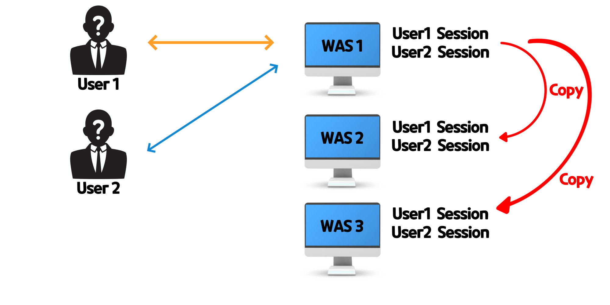
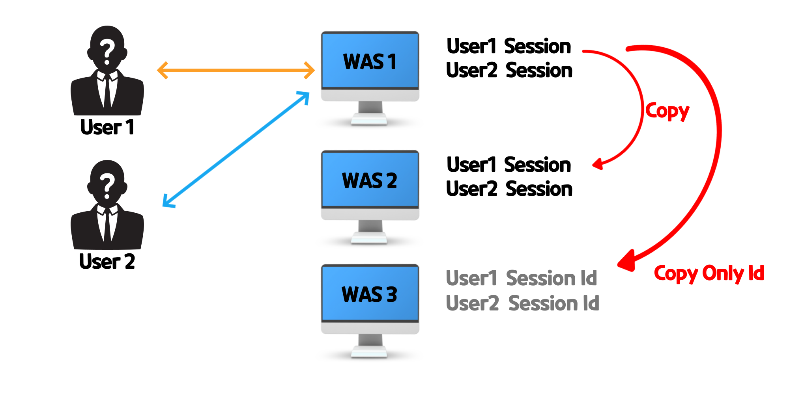

# 대량 트래픽 처리
**널리 알려진 여러 대량 트래픽 해결책들을 알아보며 어떻게 대비할지 상상해보자**
#

## 서버 업그레이드 방법
### 1. Scale-Up(스케일 업)
스케일업은 더 좋은 CPU, 더 많은 RAM 등 서버 컴퓨터의 사양을 올리는 것이다.  
업그레이드가 비교적 간단하지만, 비용 측면에서 부담이 심하다는 단점이 있다.

### 2. Scale-Out(스케일 아웃)
스케일 아웃은 서버의 개수를 추가하는 것이다. 스케일 업에 비해 비용 부담이 적고, 한계가 존재하지 않다는(공간만 있다면 계속 추가할 수 있으니까) 장점이 있다.  
하지만 여러대의 서버를 둠으로써 메모리를 공유하지 못하기 때문에 로그인 관련 세션 쿠키 공유 문제나 DB 데이터 불일치와 같은 **데이터 정합성 문제** 가 발생할 수 있다.

#
## 그렇다면 데이터 정합성은 어떻게 해결하는가?
### 1. Sticky Session(스티키 세션)
Sticky Session이란 말 그대로 고정된 세션을 의미한다. 쉽게 말해 각 웹 서버에 유저들은 전담시키는 방법이다.  
예를 들어 A라는 유저가 1번 웹서버에 로그인을 하면 그 이후의 요청은 계속 1번 웹서버가 전담하게 된다.  
 
로드밸런서가 어떤 요청이 들어왔을 때 쿠키를 확인하고 해당하는 웹 서버에게 전달해 준다. 이를 통해 다중 서버는 정합성 문제를 해결할 수 있다.  
하지만 이 **Sticky Session 방식에는 큰 단점이 존재한다.**
 
Sticky Session은 고정된 세션을 사용하며 이는 곧 특정 서버에 트래픽이 집중될 수 있음을 의미한다.  
WAS1에 100명의 트래픽이, WAS2에 50명의 트래픽이 발생할 수 있다는 뜻이다.  
 
정리하자면 **Sticky Session 방식은 트래픽 분산이 잘 되지 않으며, 한 서버가 예기치 않게 중단되었을 때 해당 세션이 날아가는 상황이 발생할 수 있다.**

### 2. Session Clustering
우선 클러스터링이란 여러 대의 컴퓨터가 하나의 시스템처럼 작동하도록 만드는 것을 말한다.  
서버도 하나의 컴퓨터이기 때문에 이 클러스터링을 활용하여 하나의 시스템처럼 동작하도록 만드는 것이다.  
대표적으로 Tomcat의 DeltaManager를 사용한 all-to-all Session Replication 방식이 있다.  
 

#### all-to-all Session Replication  

 
all-to-all 세션 복제는 **모든 서버가 세션 저장소를 전부 똑같이 복제해서 가지고 있는 것**을 말한다.  
한 서버의 세션 저장소에 변경이 이뤄지면 다른 모든 서버의 세션 저장소도 똑같은 상태로 복사하는 것이다.  
 
이로써 모든 서버가 동일한 세션을 가지고 있기 때문에 정합성도 해결되고, 한 서버가 예기치 않게 중단되었을 때에도 세션을 보존할 수 있게 되었다.  
 
하지만 같은 데이터를 중복해서 저장하고 있기 때문에 **많은 메모리가 필요**하고 세션값이 추가 또는 변경될 때마다 모든 서버의 값을 변경해야 하므로 **서버 수에 비례하여 네트워크 트래픽이 증가**하게 된다.  
이는 **전반적인 성능저하**로 이어지기 때문에 대규모 시스템에는 적합하지 않다. 하지만 4개 이하의 소규모 다중서버에는 오히려 좋은 효율을 보여준다고 한다.  
 
 
#### primary-secondary Session Replication

  
 
이 방식은 Tomcat이 all-to-all 세션 복제의 메모리 문제를 해결하기 위해 고안한 방식이다.  
각 세션별로 Primary 서버와 Secondary 서버를 지정함으로써 메모리 문제를 해결하고자 하였다.

    Primary 서버: 세션 저장
    Secondary 서버: 세션 복제본 저장
    나머지 서버: JSESSION ID만 저장

기존의 all-to-all 방식보다 **안정성은 떨어지지만** 모든 서버가 세션을 복제, 저장하고 있지 않기 때문에 **메모리와 트래픽 문제가 어느정도 해소**된다.  

### 3. 세션 스토리지 분리
**세션 저장소를 각 서버에 두는게 아니라 따로 분리하여 하나로 통합하는 방식**이다.  
따로 **세션을 위한 데이터베이스를 만들어서 이를 참조**한다.  
 
여기서 데이터베이스는 데이터가 어느 곳에 저장이 되는가를 기준으로  
***디스크 기반의 데이터베이스***와 메모리에 저장하는 ***In-Memory 데이터베이스***로 분류된다.  
 
 
#### 디스크 기반의 데이터베이스
디스크 기반 데이터베이스에는 우리가 흔히 사용하는 예로 MySql과 같은 관계형 데이터베이스가 있다.  
디스크에 저장하기 때문에 전원이 갑자기 꺼져도 영구적으로 보관이 가능하지만 기계적으로 저장되기 때문에 I/O가 느린 디스크 방식은 비번하게 Read/Write가 이뤄지는 세션 저장소로써는 불리하다.  
 

#### In-Memory 데이터베이스
In-Memory 데이터베이스는 **메인 메모리에 설치**되어 운영되며 흔히 사용하는 예로는 Redis, Memcached 등이 있다.  
기본적으로 메인 메모리(RAM)은 디스크보다 연산 속도가 수백배 빠르기 때문에 **I/O에 대한 부담이 적고, 더 적은 CPU 명령을 실행**한다.  
(더 적은 CPU 명령을 실행한다 == 행해야 하는 연산 수 자체가 적다)  
 
하지만 빠른 속도를 자랑하는 대신 메인 메모리(RAM)의 특성 상 **휘발성**이기 때문에 전원이 공급되지 않는 순간, 기억하고 있는 데이터를 전부 잃어버리게 된다.  
 
이러한 단점을 극복하기 위해 Redis 같은 경우 **RDB 방식과 AOF라는 데이터를 디스크에 백업하는 방식**이 있다.  
이러한 방식들에 대한 정리는 레디스 정리에서...