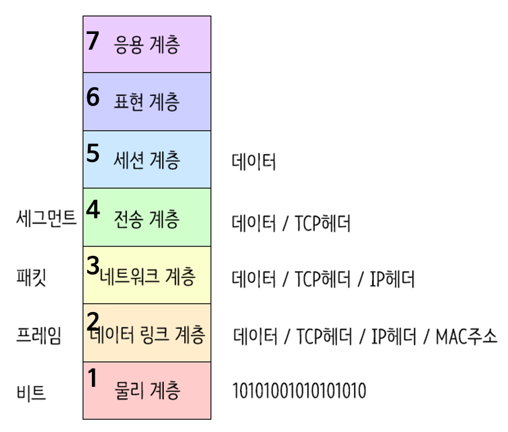

# HTTP
**웹 개발자라면 모르면 안되는 HTTP 정리**

 
 
 

## HTTP(HyperText Transfer Protocol) 란?
HTTP는 HTML 문서와 같은 리소스들을 가져올 수 있도록 해주는 *프로토콜*이다.
초기에는 단순 웹 브라우저와 웹 서버 간의 통신을 위해 디자인 되었지만, 최근에는 모바일 앱, IoT 등과의 통신과 같이 다양한 목적으로 사용되고 있다.  
HTTP는 클라이언트가 요청을 생성하기 위한 연결을 연 다음 응답을 받을 때까지 대기하는 전통적인 클라이언트-서버 모델을 따른다.  
HTTP는 무상태 프로토콜이며, 이는 서버가 두 요청 간에 어떠한 상태나 데이터를 유지하지 않음을 의미한다. (서버에서는 쿠키, 세션, 토큰 등으로 이를 극복)  
일반적으로 안정적인 TCP/IP 레이어를 기반으로 사용하는 응용 프로토콜이다.
> 프로토콜(Protocol)은 컴퓨터나 네트워크 장비가 서로 통신하기 위해 미리 정해 놓은 약속, 규약

 
 
 

## TCP/IP 와의 관계는?
일반적으로 사용되는 네트워크는 TCP/IP라는 프로토콜을 통해 통신을 하는데, HTTP는 그 중 하나다.  
**즉, http는 tcp 기반으로 만들어진 프로토콜이다.**  
이를 이해하기 위해선 OSI 7 Layer를 이해해야 한다.

 
 
 

## OSI 7 Layer
OSI 7 계층이란 네트워크 통신이 일어나는 과정을 7단계로 나눈 국제 표준화 기구(ISO)에서 정의한 네트워크 표준 모델이다.  
아래 그림을 보면, 1계층(물리 계층) ~ 7계층(응용 계층)으로 구성되어 있다.  
또 그림과 같이 각 계층을 지날 때마다 각 계층에서 Header가 붙게되고 수신측은 역순으로 헤더를 분석하게 된다.

 
 
 

### 1계층 - 물리 계층(Physical Layer)
- 주로 전기적, 기계적, 기능적인 특성을 이용해서 통신 케이블로 데이터를 전송하는 물리적인 장비
- 단지 데이터를 전기적인 신호(0, 1)로 변환해서 주고받는 기능만 함
- 이 계층에서 사용되는 통신 단위는 비트(Bit)이며 이것은 1과 0으로 나타내어지는, 즉 전기적으로 On, Off 상태를 의미한다.
- 예시로는 통신 케이블, 리피터, 허브 등이 있다.

### 2계층 - 데이터 링크 계층(DataLink Layer)
- 물리 계층을 통해 송수신 되는 정보의 오류와 흐름을 관리하여 안전한 통신의 흐름을 관리
- 프레임에 물리적 주소(MAC address)를 부여하고 에러검출, 재전송, 흐름제어를 수행
- 이 계층에서 전송되는 단위는 프레임(Frame)
- 예시로는 브릿지, 스위치, 이더넷 등이 있다. (이 계층에서 MAC adress를 사용)
- 브릿지나 스위치를 통해 맥주소를 가지고 물리 계층에서 받은 정보를 전달함

### 3계층 - 네트워크 계층(Network Layer)
- 데이터를 목적지까지 가장 안전하고 빠르게 전달
- 라우터(Router)를 통해 경로를 선택하고 주소를 정하고(IP) 경로(Route)에 따라 패킷을 전달 -> 여기서 IP 헤더가 붙음
- 이 계층에서 전송되는 단위는 패킷(Packet)
- 예시로는 라우터가 있다.

### 4계층 - 전송 계층(Transport Layer)
- port 번호, 전송방식(TCP/UDP) 결정 -> 여기서 TCP 헤더가 붙는다.
    - TCP: 신뢰성, 연결지향적
    - UDP: 비신뢰성, 비연결성, 실시간
- 두 지점간의 신뢰성 있는 데이터를 주고 받게 해주는 역할
- 신호를 분산하고 다시 합치는 과정을 통해서 에러와 경로를 제어

### 5계층 - 세션 계층(Session Layer)
- 주 지점간의 프로세스 및 통신하는 호스트 간의 연결 유지
- TCP/IP 세션 체결, 포트번호를 기반으로 통신 세션 구성

### 6계층 - 표현 계층(Presentation Layer)
- 전송하는 데이터의 표현방식을 결정(ex: 데이터 변환, 압축, 암호화 등)
- 파일 인코딩, 명령어를 포장, 압축, 암호화

### 7계층 - 응용 계층(Application Layer)
- 최종 목적지로, 응용 프로세스와 직접 관계하여 일반적인 응용 서비스를 수행
- HTTP, FTP 등과 같은 프로토콜을 사용한다.

 
 
 

## HTTP 요청 메서드

### GET
특정 리소스를 받기 위한 요청이다. 리소스의 생성, 수정 및 삭제 등에 사용해서는 안된다.

### POST
특정 리소스를 생성하거나 컨트롤러를 실행하는 데 사용한다. 

### PUT
변경 가능한 리소스를 업데이트 하는데 사용되며 항상 리소스 식별 정보를 포함해야 한다.

### PATCH
변경 가능한 리소스의 부분 업데이트에 사용되며 항상 리소스 식별 정보를 포함해야 한다.  
PUT을 사용해 전체 객체를 업데이트하는 것이 관례여서 거의 사용되지 않는다.

### HEAD
클라이언트가 본문 없이 리소스에 대한 헤더만 검색하는 경우 사용한다.  
일반적으로 클라이언트가 서버에 리소스가 있는 지 확인하거나 메타 데이터를 읽으려는 때만 GET 대신 사용한다.

### OPTIONS
클라이언트가 서버의 리소스에 대해 수행 가능한 동작을 알아보기 위해 사용한다.  
일반적으로 서버는 이 리소스에 대해 사용할 수 있는 HTTP 요청 메서드를 포함하는 Allow 헤더를 반환한다. (CORS에 사용)

> PUT과 PATCH의 차이에 대한 좋은 글  
> https://velog.io/@vagabondms/%EA%B8%B0%EC%88%A0-%EC%8A%A4%ED%84%B0%EB%94%94-PUT%EA%B3%BC-PATCH-%EC%B0%A8%EC%9D%B4

 
 
 

## HTTP 메시지

### 요청 
  
해당 요청의 요약정보를 알려주는 start line 부터 메시지가 시작된다.  
그 후 Request Header 목록이 나열되고, 한 줄의 empty line 이후 Request Body가 시작된다.  
 

### 응답
  
해당 응답의 요약정보를 알려주는 start line 부터 메시지가 시작된다.
그 후 Response Header 목록이 나열되고, 한 줄의 empty line 이후 Request Body가 시작된다. 